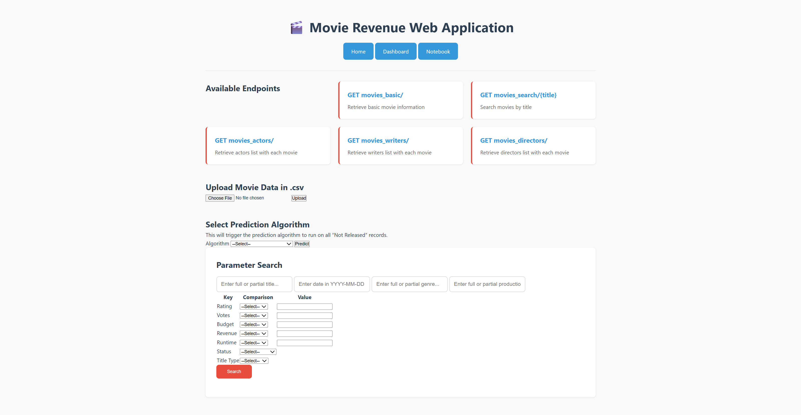

# Movie Revenue Web Application

## Objective ✔️

The main objectives are:
- Be able to make prediction on the revenue of movies that will be released in the next 5-6 months. 
- To experience on predicting box office revenue for movies using different approaches including sentiment analysis on user comments.
- To experience with API production and dashboard integration.

End Project: To deliver a web application supporting CRUD operation from data sources and can review revenue prediction results.

## Research Question:
- How can we control the inflation rate if we want to use early movies? (Using the Consumer Price Index could be a solution.) ✔️
- How do we standardize movie revenue? (The revenue variable we have is probably gross revenue since the movie's release, we can try to classified movie revenue into categories to standardized it to certain extent)
- Using information from five years earlier might not be reliable. (We can probably solve this issue by including more covariates) ✔️
---
## Data Source:
- https://www.imdb.com/list/ls026411399 (A director billboard)
- https://www.the-numbers.com/movies/release-schedule (For future movie release)
- https://developer.imdb.com/non-commercial-datasets/ (Official data provided by imdb)
- https://arxiv.org/pdf/2405.11651v1
- https://github.com/vikranth3140/movie-revenue-prediction
- https://www.kaggle.com/datasets/asaniczka/tmdb-movies-dataset-2023-930k-movies
- https://github.com/arnab-api/movie-analysis
- https://arxiv.org/pdf/2110.07039
---
## File Description:
- populate_data.py - Create the movie_data.csv file, by requesting downloadable IMDB official data, and integrated it with a pre-existing movie dataset for more featuring.
- data_encoding.py - Encoded qualitative variables of the movie_data.csv file and outputs the encoded file as a csv file.
- db.py - Set up the database connection (mysql in particular)
- models.py - Set up the table class
- populate_database - Imports movie_data.csv into the designated mysql database.
  - Requires mysql server, a database schema named 'movie_API', and your mysql key and password
- movie_api.py - RESTApi supporting Create, Read, Update, and Delete capability. 
---
## Progress Check

### 0. **Set Up**
- **Group Chat** ✔️
- **Github Repo** ✔️
- **Python Environment** ✔️
- **Power BI OR Tableau Access** ✔️
### 1. **Literature Review** ✔️ (But will continue)
- **Key Questions To Answer**: Possible Data Sources, Possible Models, Guide to preprocessing, Possible Approaches
### 2. **Gathering Data Source** ✔️
- **Possible Data Sources**: IMDB (https://www.imdb.com), Box Office Mojo (https://www.boxofficemojo.com)
- **Popular Features**: Cast, number of screen or theatres that the movie will be released on, genre, rating, budget, seasonality (time of release), whether it's sequel, word-of-mouth (number of views, number of likes, and percentage of positive and negative reviews), level of competition of a movie (whether it's released with other popular movies or not), level of advertisements.
### 3.a **Create a Reference Model for Benchmark** ✔️
- Using only a handful of important variables (subjective) to create reference model for benchmark purpose. ✔️
### 3.b **Preprocess the Data (Create dependent variables)** ✔️
### 4.a **Machine Learning Notebook**
- Create baseline models (Suggested black-box models like MLP) 
### 4.b **Web API Application**
### 4.c **Tableau Dashboard**
### 5 **Final Integration**
---
## How to run the application
1) Create a virutal environment for this application, and ran pip install requirements.txt to install all the dependencies.
2) Fill out your MySQL username and password in db.py, and create a movie_API database using MySQL workbench. 
3) Run populate_data.py to get the latest information (Restricted by our raw file, we should be able to re-update the information once we figure out the source of the raw data file 'Movie_data.csv').
4) Run populate_database.py to populate (insert) the data to the MySQL database.
5) Run movie_API.py
